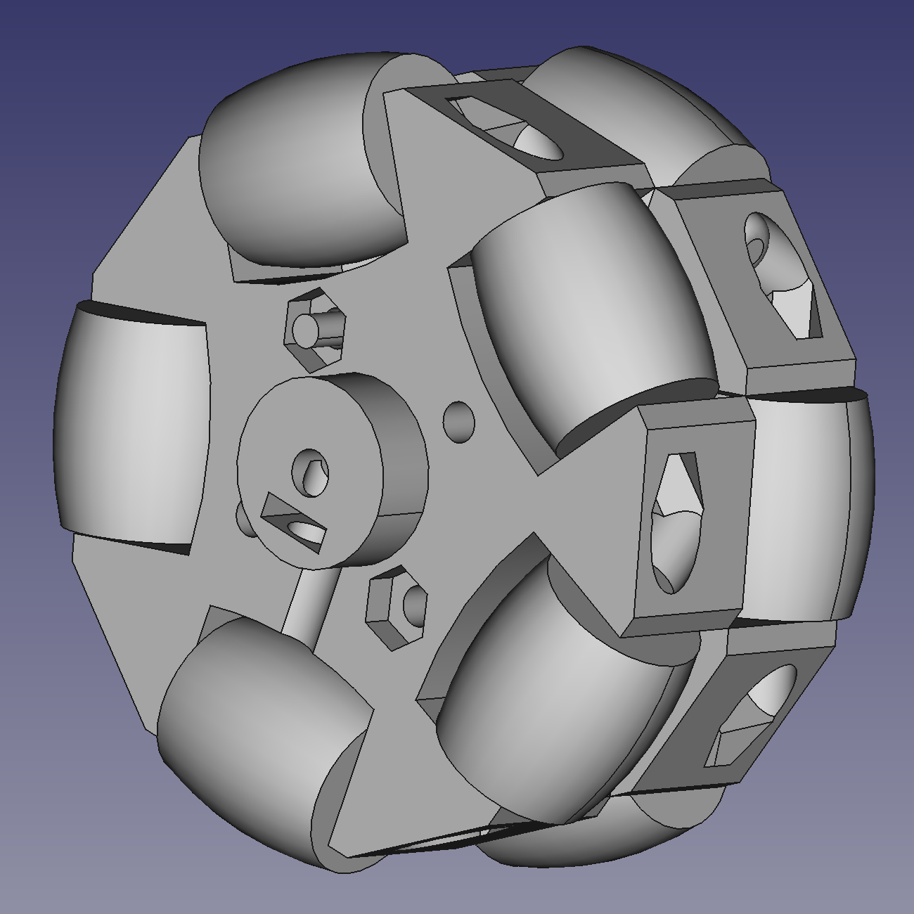

# Omniwheel - printable design

This is a design for an [omniwheel](https://en.wikipedia.org/wiki/Omni_wheel) that can be 3D printed with a cheap hobby printer.

The design was created for use with the [Pimoroni Micro Metal Motor](https://shop.pimoroni.com/products/micro-metal-gearmotor-extended-back-shaft?variant=39421592043603) so has a 3mm hub hole.

To assemble one wheel you will need:

* 10 x rollers (printable part) recommend TPU
* 2 x hub sides (printable part) recommend PETG
* 12 x 25mm M2.5 Pan head screw (I used [Westfield A2 stainless Torx head](https://www.westfieldfasteners.co.uk/Bolts_Screws_Metric/Torx_Pan_Screw_M2.5x25_A2_Stainless.html))
* 10 x M2.5 narrow nyloc nuts (I used [Westfield DIN985 nut](https://www.westfieldfasteners.co.uk/Metric_Nuts/Nyloc_Nut_Type_T_Thin_M2.5_A2_Stainless.html))
* 2 x M2.5 full nut
* 1 x M3 square nut (for the grub screw)
* 1 x 6mm M3 Pan head screw (as a grub screw)

Print two of he hub sides and place them back to back rotated by 180 degrees.  Use two M2.5 x 25mm bolts and two M2.5 full nuts to fix the two halves together.  Fit the rollers one at a time with the M2.5 x 25 screws and nyloc nuts.  Finally push the square M3 nut into the hole and secure the wheel to an axel with an M3 pan head or grub screw.

This is V2 of the wheel, the first iteration had the same general structure but the rollers were much smaller diameter and the bolt heads and nuts protruded past the circumference of the wheel.  The original design is still in the FreeCAD file if you're interested.
